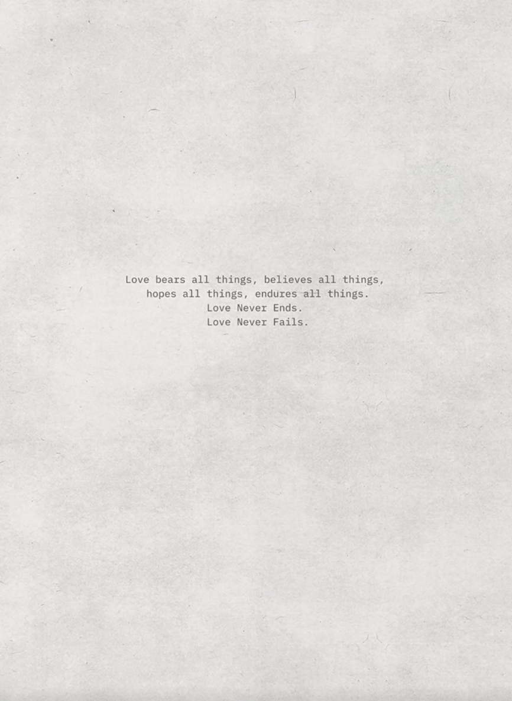
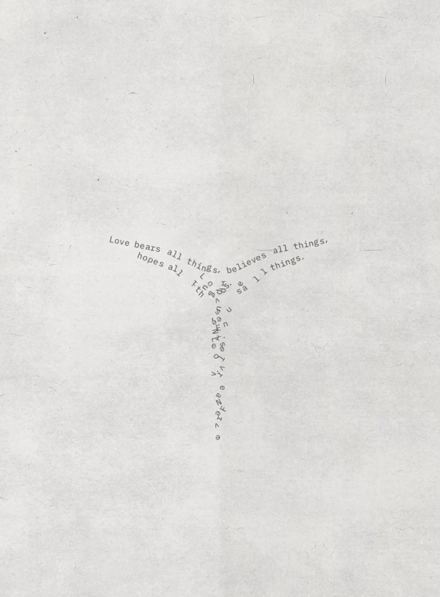
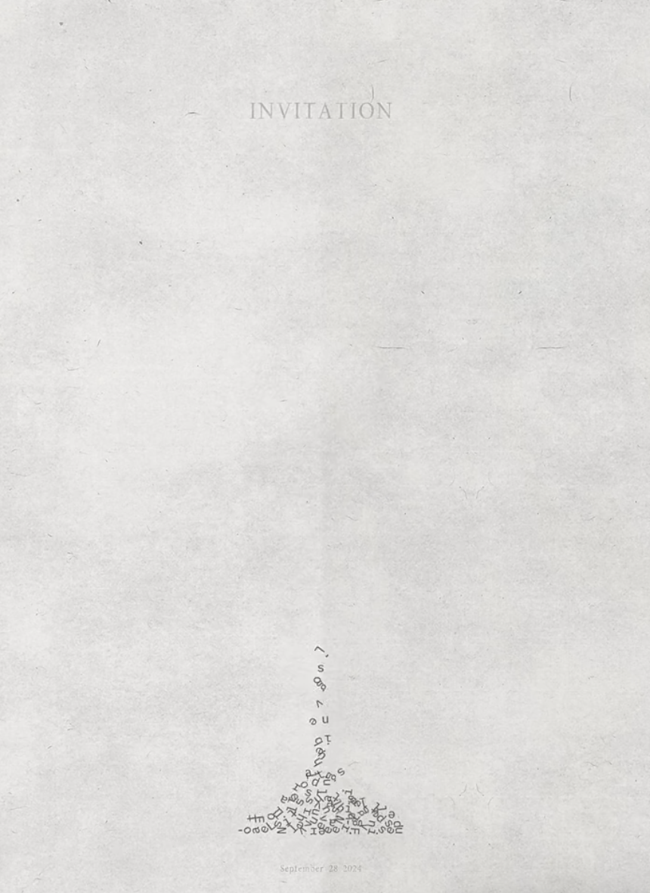
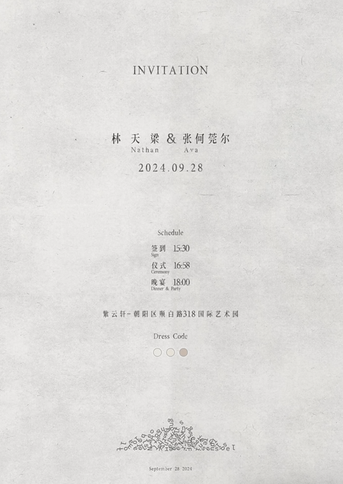
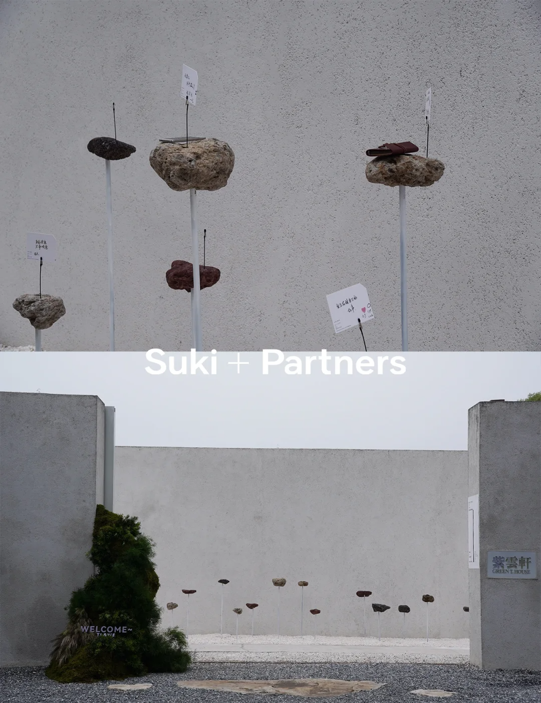

# PDF设计稿实现指南

## 📋 概述

本指南说明如何将PDF设计稿转换为HTML网页，已创建的文件包括：

- `new-index.html` - 主页（包含封面、介绍、目录、联系）
- `project-tree.html` - 项目详情页示例（01树）
- `project-pulu.html` - 项目详情页示例（02噗噜）

## 🎨 设计风格特点

根据PDF设计稿，网站采用以下设计元素：

1. **背景**：使用统一的纹理背景图（`背景（也是所有页面的背景）.png`）
2. **配色**：自然、柔和的色调，以米白色、浅绿色为主
3. **布局**：简洁、留白充足，注重视觉呼吸感
4. **装饰元素**：使用插画、分隔线等装饰元素增加趣味性
5. **侧边装饰**：项目详情页右侧固定装饰图

## 📁 文件结构

```
src/
├── new-index.html          # 主页
├── project-tree.html       # 01树 项目页
├── project-pulu.html       # 02噗噜 项目页
├── project-onroad.html     # 03在路上 项目页（待创建）
├── project-wind.html       # 04与风同频 项目页（待创建）
├── project-dance.html      # 05起舞吧 项目页（待创建）
├── project-playground.html # 06游乐场 项目页（待创建）
└── new/
    └── SP网页图片素材/
        ├── P1-P2（封面与介绍）/
        ├── P3（目录页）/
        ├── P4-P8（01树）/
        ├── P9-P12（02噗噜）/
        ├── P13-P18（03在路上）/
        ├── P19-P23（04与风同频）/
        ├── P24-P28（05起舞吧）/
        ├── P29-P34（06游乐场）/
        ├── P35-P48（植物与花艺）/
        └── P49-P52（尾页）/
```

## 🚀 快速开始

### 1. 查看主页
直接在浏览器中打开 `new-index.html`

主页包含：
- **封面区域**：品牌插画 + Logo
- **介绍区域**：工作室介绍文字 + 插画
- **目录区域**：6个项目的缩略图网格
- **联系区域**：联系方式和尾页插画

### 2. 查看项目详情页
点击目录中的项目卡片，或直接打开：
- `project-tree.html` - 查看"01树"项目
- `project-pulu.html` - 查看"02噗噜"项目

## 🛠️ 创建其他项目页面

### 方法1：复制模板修改

以创建"03在路上"为例：

1. **复制模板文件**
   ```bash
   复制 project-tree.html 为 project-onroad.html
   ```

2. **修改标题**
   ```html
   <title>03 在路上 - Suki+Partners</title>
   ```

3. **替换头部图片**
   ```html
   <!-- 侧边装饰 -->
   
   
   <!-- 项目标题图 -->
   
   
   <!-- 装饰插画 -->
   
   ```

4. **根据PDF布局添加内容区域**

   参考PDF中P13-P18的布局，使用以下HTML结构：

   ```html
   <!-- 单张大图 -->
   <div class="single-image">
       
   </div>

   <!-- 两列布局 -->
   <div class="two-column">
       
       
   </div>

   <!-- 三列布局 -->
   <div class="three-column">
       
       
       
   </div>

   <!-- 装饰元素 -->
   <div class="decoration-image">
       
   </div>

   <!-- 分隔线 -->
   <div class="divider">
       
   </div>
   ```

### 方法2：按PDF页面逐页实现

#### P14页面示例（6张图片网格）
```html
<div class="content-section">
    <div class="three-column">
        
        
        
    </div>
    <div class="three-column">
        
        
        
    </div>
</div>
```

#### P16页面示例（带装饰边框）
```html
<div class="content-section">
    <!-- 主图 -->
    <div class="single-image">
        
    </div>
    
    <!-- 装饰边框 -->
    <div class="decoration-image">
        
    </div>
    
    <!-- 两张方形图 -->
    <div class="two-column">
        
        
    </div>
    
    <!-- 装饰边框 -->
    <div class="decoration-image">
        
    </div>
</div>
```

## 📐 布局规则

### 图片布局选择

根据PDF中的布局，选择合适的CSS类：

| PDF布局 | CSS类 | 说明 |
|---------|-------|------|
| 单张大图 | `.single-image` | 居中显示，最大宽度1200px |
| 左右两张 | `.two-column` | 2列网格，间距40px |
| 三张横排 | `.three-column` | 3列网格，间距30px |
| 装饰插画 | `.decoration-image` | 居中显示，最大宽度400-600px |
| 分隔线 | `.divider` | 居中显示，最大宽度800px |

### 特殊元素

1. **侧边装饰图**（固定在右侧）
   ```html
   <div class="side-decoration">
       
   </div>
   ```

2. **泡泡装饰**（如02噗噜项目）
   ```html
   <div class="bubble-decoration">
       
       
       <!-- 更多泡泡... -->
   </div>
   ```

## 🎯 待完成的项目页面

根据PDF，还需创建以下项目页面：

### 1. 03在路上 (P13-P18)
- 主题图：沙漏
- 特点：多张照片网格，带装饰边框
- 图片数量：约30张

### 2. 04与风同频 (P19-P23)
- 主题图：与风同频
- 特点：Logo展示，多样化布局
- 图片数量：约25张

### 3. 05起舞吧 (P24-P28)
- 主题图：起舞吧
- 特点：动感插画装饰
- 图片数量：约20张

### 4. 06游乐场 (P29-P34)
- 主题图：游乐场
- 特点：活泼色彩
- 图片数量：约18张

### 5. 植物与花艺 (P35-P48)
- 这是一个大型专题，可以作为独立页面或子分类

## 💡 实现技巧

### 1. 图片裁剪说明
某些图片文件名包含裁剪说明，例如：
- `P15-1（需裁剪）.png` - 需要裁剪
- `P16-2（裁剪成正方形）.png` - 裁剪为正方形
- `P21-1（只取上半张）.png` - 只使用上半部分

可以使用CSS来实现裁剪效果：
```css
.crop-square {
    aspect-ratio: 1/1;
    object-fit: cover;
}

.crop-top-half {
    height: 400px;
    object-fit: cover;
    object-position: top;
}
```

### 2. 响应式设计
已包含响应式断点：
- 桌面：> 1024px（3列网格）
- 平板：768px - 1024px（2列网格）
- 手机：< 768px（1列网格）

### 3. 性能优化
- 使用图片懒加载
- 添加加载动画
- 优化大图尺寸

## 🔧 自定义样式

### 修改配色
在CSS中修改以下变量：
```css
/* 主色调 */
color: #8B9D83;  /* 浅绿色 */

/* 背景色 */
background: rgba(255, 255, 255, 0.95);

/* 文字颜色 */
color: #333;
```

### 修改动画
调整动画时长和效果：
```css
@keyframes fadeInUp {
    from {
        opacity: 0;
        transform: translateY(30px);
    }
    to {
        opacity: 1;
        transform: translateY(0);
    }
}
```

## 📱 测试清单

创建完成后，请测试：
- [ ] 所有图片正确加载
- [ ] 导航链接正常工作
- [ ] 返回按钮功能正常
- [ ] 响应式布局在不同设备上正常显示
- [ ] 动画效果流畅
- [ ] 页面加载速度可接受

## 🎨 设计一致性检查

确保与PDF设计稿保持一致：
- [ ] 使用统一的背景图
- [ ] 保持相同的间距和留白
- [ ] 装饰元素位置正确
- [ ] 图片排列顺序与PDF一致
- [ ] 字体大小和样式匹配

## 📞 需要帮助？

如果在实现过程中遇到问题：
1. 参考已完成的 `project-tree.html` 和 `project-pulu.html`
2. 检查图片路径是否正确
3. 确认CSS类名使用正确
4. 查看浏览器控制台的错误信息

## 🚀 下一步

1. 在浏览器中打开 `new-index.html` 查看效果
2. 根据本指南创建其余4个项目页面
3. 根据需要调整样式和布局
4. 优化图片大小以提升加载速度
5. 添加更多交互效果（可选）

---

**提示**：所有页面都使用相同的设计系统和组件，保持一致性是关键！
